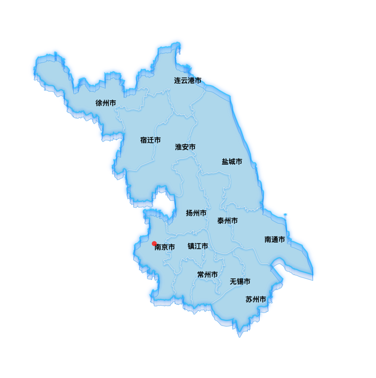

# mapCustom

[](https://www.npmjs.com/package/map-custom)
[](https://www.npmjs.com/package/map-custom)

**mapCustom**是一个通过ECharts创建SVG形式渲染的仿3D效果的地图

**功能示例：**



## Install

通过npm安装:

```bash
npm install map-custom --save
```

## Import

```js
import {createCustomMap} from "map-custom";
```

## Usage

```js
const {mapSvg, geoUtils, renderTextShapes} = createCustomMap({
    echarts,
    viewportSize: {
        width: dom.offsetWidth,
        height: dom.offsetHeight
    },
    fullGeoJson: require("./全省GeoJson.json"),
    regionGeoJson: require("./包含子区域GeoJson.json")
})
```

## 参数

### echarts

echarts对象

### viewportSize

视图大小

**参数**

- `width` 视图的宽度
- `height` 视图度高度

### fullGeoJson

不包含子区域的GeoJson文件
[GeoJson选择器](http://datav.aliyun.com/portal/school/atlas/area_selector#&lat=32.96258644191747&lng=119.16320800781249&zoom=7)

### regionGeoJson

包含子区域的GeoJson文件
[GeoJson选择器](http://datav.aliyun.com/portal/school/atlas/area_selector#&lat=32.96258644191747&lng=119.16320800781249&zoom=7)

### mapStyle

[地图样式](https://echarts.apache.org/zh/option.html#series-map.itemStyle)

### bottomMapStyle

[底部地图样式](https://echarts.apache.org/zh/option.html#series-custom.renderItem.return_polygon.style)

### lightBorderStyle

[边界描边样式](https://echarts.apache.org/zh/option.html#series-custom.renderItem.return_polygon.style)

### layerMapStyle

[各层级地图样式](https://echarts.apache.org/zh/option.html#series-custom.renderItem.return_polygon.style)


**代码示例**

```js
// 注册SVG地图
echarts.registerMap("custom-map", {svg: mapSvg});
const chart = echarts.init(dom)
chart.setOption({
    geo: [
        {
            map: 'custom-map', // 使用注册的地图
            roam: true,
            label: {
                show: false,
                color: "#000a3c",
            },
            emphasis: {
                label: {
                    show: false,
                },
                itemStyle: {
                    areaColor: "#ff0101",
                },
            }
        },
    ],
})
```

```js
// 坐标转换为像素点
const point = geoUtils.dataToPoint([118.7846, 32.08513])
chart.setOption({
    series: [{
        type: 'scatter',
        coordinateSystem: 'geo',
        data: [point]
    }]
})
```

```js
// 添加自适应地图城市文本
const point = geoUtils.dataToPoint([118.7846, 32.08513])
chart.setOption({
    series: [{
        type: 'custom',
        coordinateSystem: 'geo',
        data: [0],
        renderItem: (params, api) => renderTextShapes(params, api, {
            style: { // 文本的样式...
                fill: 'black'
            },
            minHide: 0.4 // zoom缩放小于0.4时候隐藏文本
        })
    }]
})
```

## LICENSE

MIT
